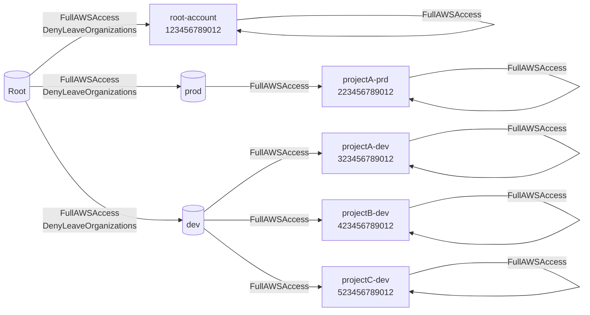

# aws-tree-organizations

This is a simple tool to visualize the AWS Organizations structure in a tree format.

For example, if your AWS Organizations hierarchy looks like the diagram below:


The result is the simplified diagram below. Above the arrow are SCPs applied to the OU or account.


This diagram is written by mermaid(flowchart). So, you can use it in your markdown file.


## Requirements

- Python 3.6+
- [rye](https://rye-up.com/)


## Installation

```bash
rye build
rye install dist/aws-tree-orgs-x.y.z.tar.gz
```


## Usage

```bash
aws-tree-orgs

# or specify a profile
aws-tree-orgs --profile <profile_name>
```
